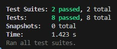
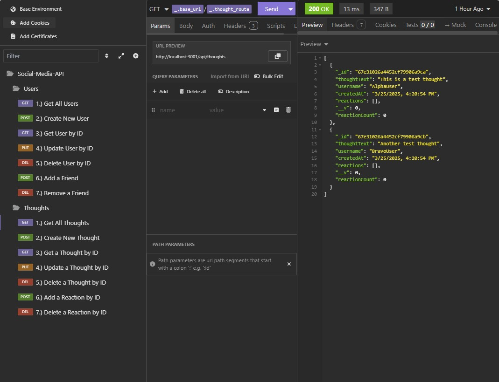

# Social-Media-API
[](https://opensource.org/licenses/MIT)

## Description
A built-from-scratch social media API that allows user to share their thoughts, connect with friends, react to the thoughts of others, and build a friend list using Express.js and MongoDB (utilizing Mongoose). Additionally, this project contains Jest test suites for testing API route functionality.


## Table of Contents
- [Installation](#installation)
- [Usage](#usage)
- [License](#license)
- [Contributing](#contributing)
- [Tests](#tests)
- [Questions](#questions)

## Installation
Clone the repository.
Open the terminal in the *root folder* and run ```npm i``` to install dependencies.
Run ```node seed.js``` to seed the database with mock data.
Run ```npm run start``` to run the server and connect to the database.

To test the application using Jest, run ```npm run test```.



## Usage

Walkthrough Video: [Currently Unavailable]

Open [Insomnia](https://insomnia.rest/) or [Postman](https://insomnia.rest/) and utilize the following routes to interact with the application:


#### User Interactions
```
1. Get All Users

Method: GET
URL: http://localhost:3001/api/users
Body: None
```
```
2. Create New User

Method: POST
URL: http://localhost:3001/api/users
Body:

  {
    "username": "newuser",
    "email": "newuser@example.com"
  }
```
```
3. Get User by ID

Method: GET
URL: http://localhost:3001/api/users/:id
Body: None
  Replace :id with the user ID.
```
```
4. Update User by ID

Method: PUT
URL: http://localhost:3001/api/users/:id
Body:

  {
    "username": "updateduser",
    "email": "updateduser@example.com"
  }

  Replace :id with the user ID.
```
```
5. Delete User by ID

Method: DELETE
URL: http://localhost:3001/api/users/:id
Body: None
  Replace :id with the user ID.
```
```
6. Add a Friend

Method: POST
URL: http://localhost:3001/api/users/:userId/friends/:friendId
Body: None
  Replace :userId with the user ID and :friendId with the friend's user ID.
```
```
7. Remove a Friend

Method: DELETE
URL: http://localhost:3001/api/users/:userId/friends/:friendId
Body: None
  Replace :userId with the user ID and :friendId with the friend's user ID.
```


#### Thought Interactions
```
1. Get All Thoughts

Method: GET
URL: http://localhost:3001/api/thoughts
Body: None
```
```
2. Create New Thought

Method: POST
URL: http://localhost:3001/api/thoughts
Body:

  {
    "thoughtText": "This is a test thought",
    "username": "testuser",
    "userId": "USER_ID"
  }

  Replace USER_ID with the ID of the user creating the thought.
```
```
3. Get a Thought by [Thought] ID

Method: GET
URL: http://localhost:3001/api/thoughts/:id
Body: None
  Replace :id with the Thought ID.
```
```
4. Update a Thought by [Thought] ID

Method: PUT
URL: http://localhost:3001/api/thoughts/:id
Body:

  {
    "thoughtText": "Updated thought text"
  }

  Replace :id with the Thought ID.
```
```
5. Delete a Thought by ID

Method: DELETE
URL: http://localhost:3001/api/thoughts/:id
Body: None
  Replace :id with the thought ID.
```
```
6. Add a Reaction by [Thought] ID

Method: POST
URL: http://localhost:3001/api/thoughts/:thoughtId/reactions
Body:

  {
    "reactionBody": "This is a reaction",
    "username": "testuser"
  }

Replace :thoughtId with the Thought ID associated with the reaction.
```
```
7. Delete a Reaction by [Thought] ID

Method: DELETE
URL: http://localhost:3001/api/thoughts/:thoughtId/reactions
Body:

  {
    "reactionId": "REACTION_ID"
  }

  Replace :thoughtId with the Thought ID with the associated reaction and REACTION_ID with the Reaction ID to be deleted.
```




## License
This project is licensed under the MIT license. For more details, see the license link: (https://opensource.org/licenses/MIT)

## Contributing
As this is a project strictly for educational purposes, no contributions will be accepted.

## Tests
Please review [Installation](#installation) for testing instructions.

## Questions
##### For any questions regarding this project, contact the project owner via: 
GitHub: [apoborka](https://github.com/apoborka)\
Email: alex.poborka@gmail.com

## Acknowledgments
This project utilized GitHub Copilot.